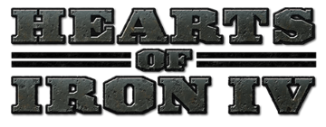
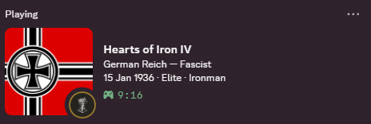
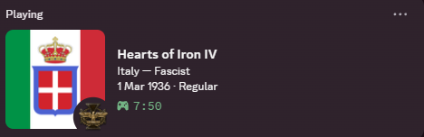
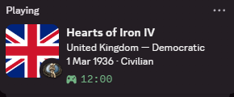
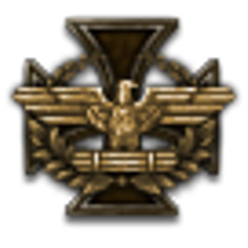
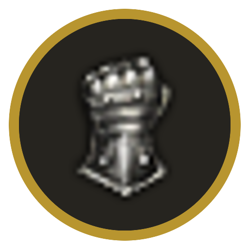

<h1 align="center">
Hoi4 Rich Presence
</h1>

<table>
<tr>
<td align="center"></td>
<td align="center"></td>
<td align="center"></td>
</tr>
</table>

## About

A Discord Rich Presence for Hearts of Iron IV, on Windows. It reads your
autosave and shows the country, ideology, in-game date and difficulty.

### What the card shows

All of it comes from the save header — nothing hooks into the running game.

| On the card                     | Where it comes from                                                         |
| ------------------------------- | --------------------------------------------------------------------------- |
| the flag                        | your country tag, mapped in [`countries.py`](src/hoi4presence/countries.py) |
| the corner badge                | your ideology, or the ironman gauntlet on an ironman run                    |
| `German Reich — Fascist`        | country name and ideology                                                   |
| `15 Jan 1936 · Elite · Ironman` | in-game date, difficulty, and ironman if set                                |
| hovering the flag               | country and the game patch the save was made on                             |
| the timer                       | how long the presence has been running                                      |

### Badges

Fascist · Democratic · Communist · Non-Aligned · Anarchist (mods only) · anything else · Ironman

## How to download and install

Download the zip from the button above, unzip it, and run `setup.exe`. The installer:

- copies the presence into `Documents\Paradox Interactive\Hearts of Iron IV\hoi4Presence`,
- sets `save_as_binary=no` in the game's `settings.txt`, because the presence reads your
  autosaves and can only do that when they are plaintext,
- drops `runRPC.exe` and `runRPC.cfg` into your game folder, and
- points the Paradox launcher at `runRPC.exe`, which starts the game and the presence together.

Run `uninstall.exe` to reverse all of that.

## Issues

HOI4 is frequently updating, see known issues in [Issues](https://github.com/ThiaudioTT/hoi4-presence/labels/bug). Found a bug? [Submit it](https://github.com/ThiaudioTT/hoi4-presence/issues/new/choose).

If the presence is not showing up, attach `hoi4Presence.log` and
`checkupdate.log` from the `hoi4Presence` folder in your documents directory.
The first records why no save was read or why Discord could not be reached, the
second why an update was skipped.

## How the presence works

It reads the saves. So spend one month in the game, or save it, to update the
presence. [docs/architecture.md](docs/architecture.md) has the developer-facing
version.

## Contributing

Feel free to contribute! I will be happy to see your pull request.

[CONTRIBUTING.md](CONTRIBUTING.md) covers running the presence from source, the
tests, and the Windows build.

## Sources

[Hoi4 Wiki](https://hoi4.paradoxwikis.com/Hearts_of_Iron_4_Wiki)

[Logo](https://www.reddit.com/r/hoi4/comments/85l962/new_game_icon_made_by_me_the_original_sucks_free/)

 
